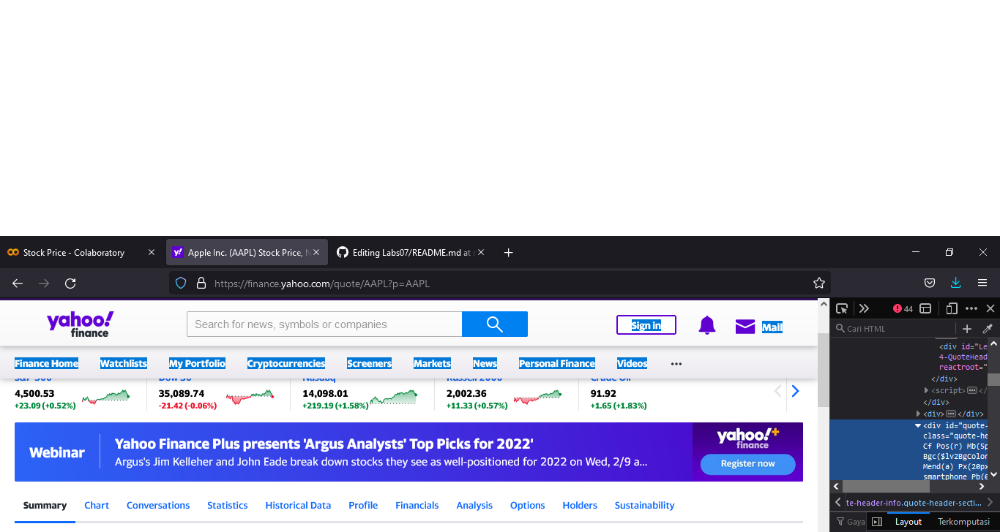

# UAS-SUSULAN
# Membuat Program Untuk Scraping Data Web
## Untuk memenuhi UAS Susulan Bahasa Pemograman

Disini saya menggunakan Google Colab, di karenakan kendala Teknis
saya tidak dapat melakukan koding di Pycharm.

Berikut Langkah-langkahnya :
### Pertama 
Masukan kodingan seperti dibawah ini :
```python 
import requests
```
Modul ``Requests`` digunakan untuk mengirim berbagai request HTTP, karena untuk membuat scraping data web kita perlu mengakses website.

### Kedua 
```python
from bs4 import BeautifulSoup
```
Selanjutnya kita akan menggunakan packpage Beautifulsoaup4 yang digunakan untuk melakukan navigasi objek DOM pada HTML.

```python
def priceTracker():
```
Nah selanjutnya, kita menggunakan ``def`` suatu bahasa pada python yang fungsinya untuk mendefinisikan sebuah method atau fungsi.

### Ketiga

Selanjutnya kita akan membuka sebuah website untuk dijadikan sebuah bahan atau target yang akan kita gunakan untuk melakukan scraping data, di sini saya menggunakan web dari ini`` https://finance.yahoo.com/quote/AAPL?p=AAPL`` untuk mengambil data Stock Price.
seperti gambar dibawah ini :

    
### Keempat
Saya akan mengambil data di ini :


### Kelima
Setelah menentukan objeknya kita akan membuat kodingan untuk mengakses web tersebut, seperti dibawah ini :

```python
    url = 'https://finance.yahoo.com/quote/AAPL?p=AAPL'

    response = requests.get(url)
    soup = BeautifulSoup(response.text, 'lxml')
    #print(soup)
```
Kodingan di atas untuk menghubungkan web dengan program yang sedang kita buat melalui text html seperti yang ada pada web ketika kita inspeksi.

### Keenam
Selanjutnya saya akan memasukan kodingan seperti di bawah ini :
```python    
    price = soup.find_all('div', {'class' : 'My(6px) Pos(r) smartphone_Mt(6px) W(100%) '})[0].find().text
    return price
```
Kodingan tersebut dimasukan sesuai dari text yang kita dapat pada saat kita menginspeksi web objek yang sudah kita tentukan, seperti di bawah ini :


### Ketujuh
Dan langkah yang terkahir adalah dengan memasukan kodingan di bawah ini :
```python
print('Current Price : ' + priceTracker())
```
Dan ini hasil akhir dari program yang sudah selesai, dengan hasil yang akurat :


## Sekian Terima Kasih

